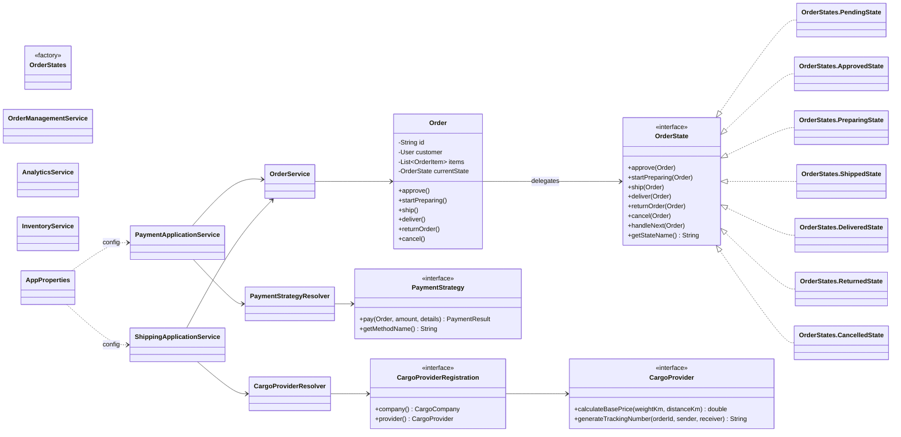
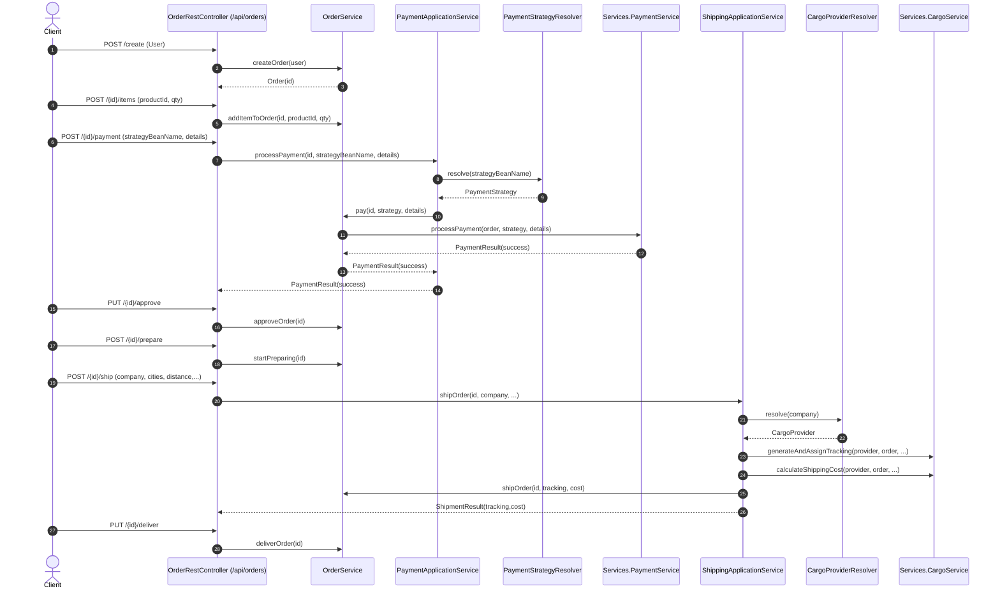
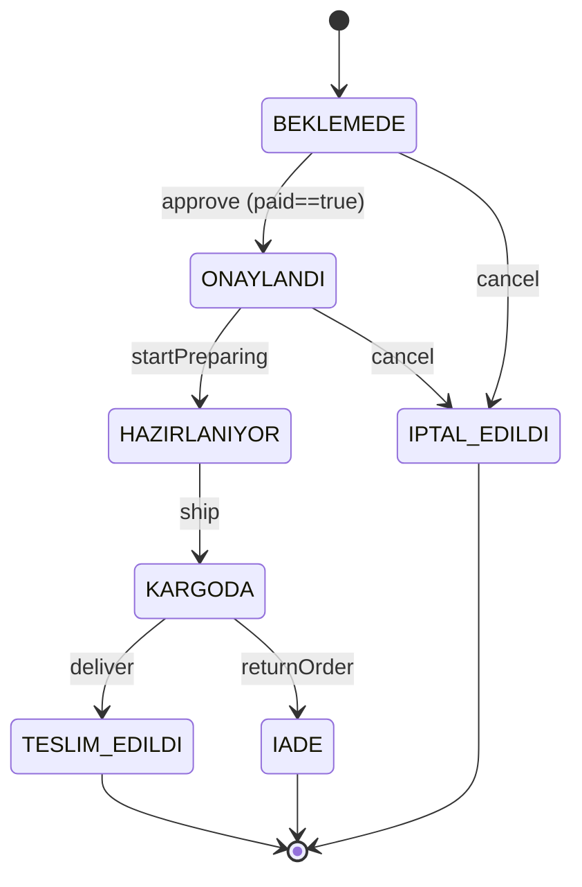

# Teslim Dokümantasyonu (Güncel Kod)

Bu doküman, proje kodunun son haliyle uyumlu olacak şekilde UML diyagramlarını, desen (pattern) gerekçelendirmesini ve test raporunu içerir.

## UML Diyagramları

### Use Case Diagram

```mermaid
flowchart LR
  %% Actors
  C[Customer]
  S[Staff]
  A[Admin]

  %% Use cases
  UC1((Login/Logout))
  UC2((Ürünleri Görüntüle))
  UC3((Sipariş Oluştur))
  UC4((Siparişe Ürün Ekle))
  UC5((Ödeme Yap))
  UC6((Kendi Siparişlerim))
  UC7((Sipariş Yönetimi\n(approve/prepare/ship/deliver)))
  UC8((Envanter Yönetimi\n(ürün ekle, stok artır)))
  UC9((Analitik/Raporlar))
  UC10((Tesisler))
  UC11((Kullanıcı Yönetimi))

  C --> UC1
  C --> UC2
  C --> UC3
  C --> UC4
  C --> UC5
  C --> UC6

  S --> UC1
  S --> UC7
  S --> UC8
  S --> UC9
  S --> UC10

  A --> UC1
  A --> UC7
  A --> UC8
  A --> UC9
  A --> UC10
  A --> UC11
```

### Class Diagram (Özet)



### Sequence Diagram (Happy Path Order Flow)

Bu akış, testte de otomatik doğrulanan REST senaryosudur.



### State Diagram (Order)



### Activity Diagram (Ship Order – Orchestration)

```mermaid
flowchart TD
  A([Başla]) --> B[Order'ı yükle]
  B --> C{Sipariş var mı?}
  C -- Hayır --> X([Hata: Sipariş bulunamadı])
  C -- Evet --> D[CargoProviderResolver ile provider seç]
  D --> E[TrackingNo üret & order'a ata]
  E --> F[ShippingCost hesapla]
  F --> G[OrderService.shipOrder(id, tracking, cost)]
  G --> H([Bitti: ShipmentResult])
```

## Pattern Tablosu (Kanıtlı)

| Problem | Seçilen Desen | Neden / Kazanım | Kanıt (Sınıf/Dosya) |
|---|---|---|---|
| Sipariş durum geçişlerinde if/switch karmaşası | **State** | Geçiş kuralları state sınıflarında; `Order` if/switch içermez | `com.project.domain.order.Order`, `OrderState`, `OrderStates` |
| Ödeme yöntemleri runtime’da değişebilsin | **Strategy** | Yeni ödeme eklemek mevcut kodu bozmadan yeni sınıf eklemekle mümkün | `PaymentStrategy`, `CreditCardPayment`, `BankTransferPayment`, `CryptoPayment` |
| Bean adına göre strateji seçimini controller’dan soyutlama | **Resolver (OCP destekli)** | `ApplicationContext.getBean` yayılmıyor; tek noktadan doğrulama/hata mesajı | `PaymentStrategyResolver`, `PaymentApplicationService` |
| Kargo firması seçimini switch ile büyütmek | **Registry/Resolver (Factory yerine kayıt)** | Yeni provider “yeni bean + registration” ile eklenir; merkezi switch yok | `CargoProviderResolver`, `CargoProviderRegistration`, `CargoProviderConfig` |
| Kargo fiyatına opsiyonel ek hizmet ekleme (sigorta/kırılgan) | **Decorator** | Kombinasyon patlaması olmadan zincirlenebilir fiyatlandırma | `CargoPricingBuilder` ve dekoratör sınıfları |
| Karmaşık Composite ürün oluşturma | **Builder** | Parametreleri okunur şekilde set; telescoping constructor yok | `CompositeProduct.Builder` |
| Stok eşik altına düşünce bildirimlerin gevşek bağlı olması | **Observer (Event Listener)** | Ürün/servis ile bildirim modülleri bağımsız; Pub/Sub | `StockLowEvent`, `EmailStockNotifier`, `InAppStockNotifier` |
| Service metotlarında tekrar eden loglama | **AOP (Cross-cutting)** | Zaman/başarı/hata logları merkezi | `LoggingAspect` |
| Yetkilendirme kontrollerinin if-else ile yayılması | **AOP + Annotation** | `@RequireRole` ile metot seviyesinde declarative auth | `RequireRole`, `SecurityAspect` |

## Test Raporu

### Kapsam (Özet)

- **Unit**
  - Sipariş iş kuralları ve durumlar: `OrderStateTest`
  - Service: `OrderServiceTest`, `InventoryServiceTest`
  - Kargo fiyat dekoratörleri: `CargoPricingBuilderTest`
- **WebMvcTest**
  - Yetkilendirme: `InventorySecurityWebMvcTest` (401/403)
- **DataJpaTest**
  - Repository sorguları: `ProductRepositoryTest` (`findBelowThreshold`)
- **Integration**
  - Happy-path order flow: `OrderFlowIntegrationTest` (create→addItem→pay→approve→prepare→ship→deliver)

### Örnek Çıktılar (Surefire Özeti)

- `OrderFlowIntegrationTest`: `Tests run: 1, Failures: 0, Errors: 0`
- `InventorySecurityWebMvcTest`: `Tests run: 2, Failures: 0, Errors: 0`
- `ProductRepositoryTest`: `Tests run: 1, Failures: 0, Errors: 0`
- `CargoPricingBuilderTest`: `Tests run: 1, Failures: 0, Errors: 0`

### Çalıştırma Komutu

```bash
./mvnw.cmd test
```

### Riskler / Notlar

- **Spring Security generated password uyarısı**: Test loglarında görülebilir; `SecurityFilterChain` tanımlı olsa da Spring bazı test context’lerinde default kullanıcı servislerini aktive edebiliyor. Üretim için ayrı konfig gerekebilir.
- **Dialect uyarıları**: Test profilinde H2 PostgreSQL mode kullanılıyor; bazı Hibernate dialect uyarıları log’da görülebilir.
- **Profil davranışı**: `dev` profili demo seed içerir (`DemoDataSeeder`), `test/prod` profillerinde seed kapalıdır.

