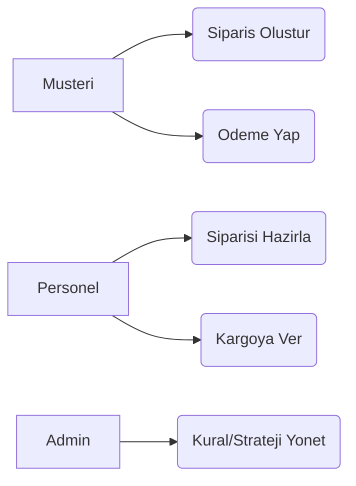
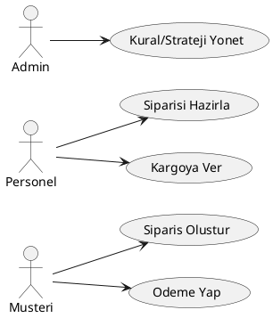
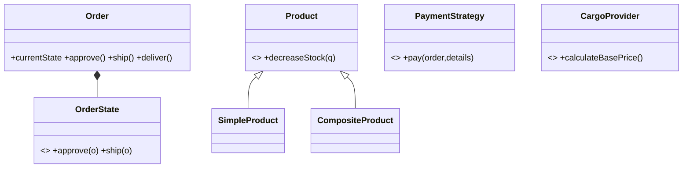
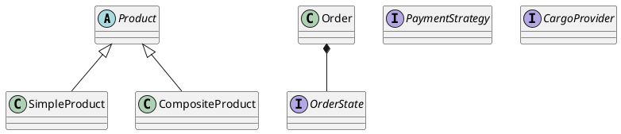
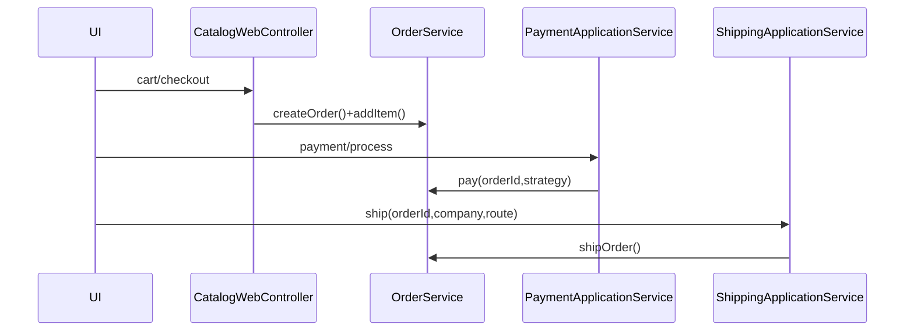
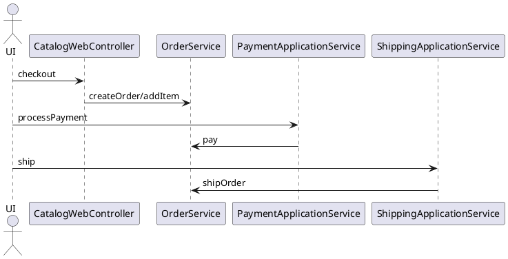
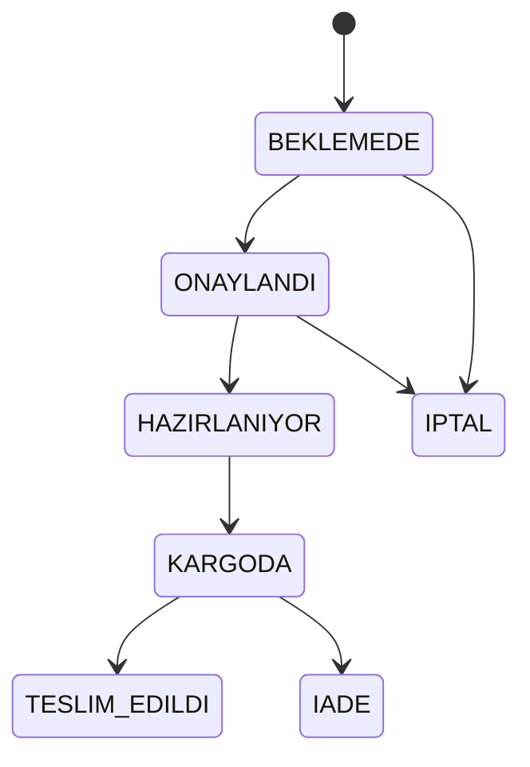
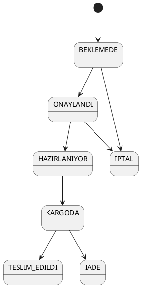
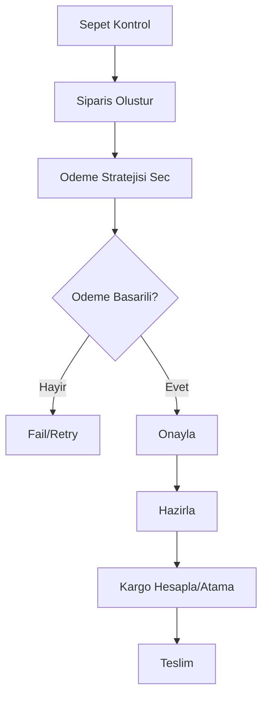
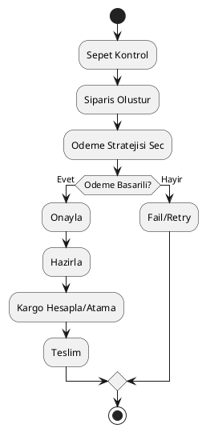

# Akilli Tedarik ve Lojistik Yonetim Sistemi
## Yazilim Mimarisi / OOAD / Design Patterns Master Savunma Raporu

Bu rapor, projeyi bir universite Yazilim Mimarisi + OOAD savunmasi formatinda, teknik derinlikli ve ogretici sekilde anlatmak icin hazirlanmistir. Icerik, mevcut kod tabani ve `docs/project_analysis_report.md` bulgulari temel alinip proje lideri perspektifiyle yeniden yapilandirilmistir.

---

## 1) Projenin Genel Mimari Analizi

### 1.1 Projenin Amaci
Sistem; urun, stok, siparis, odeme ve kargo sureclerini tek bir lojistik omurgada yonetmeyi hedefler. Temel hedef:
- Is kurallarini domain katmaninda izole etmek
- Degisen odeme/kargo entegrasyonlarina dayanikli olmak
- Test edilebilirlik ve genisletilebilirlik saglamak

### 1.2 Uctan Uca Is Akisi
1. Musteri katalogdan urun secer, sepete ekler
2. Siparis olusturulur (`BEKLEMEDE`)
3. Odeme stratejisi secilip odeme alinir
4. Siparis onay/hazirlama/kargo sureclerinden gecer
5. Teslim veya iade ile lifecycle kapanir
6. Stok esik altina inerse observer tabanli bildirim tetiklenir

### 1.3 MVC Uygulamasi (Projeye Ozel)
- **Controller:** `com.project.controller.*`, `com.project.api.controller.*`
- **Model (Domain):** `com.project.domain.*`
- **View:** `src/main/resources/templates/*.html` (Thymeleaf)
- **Application Service:** `com.project.service.*`
- **Persistence:** `com.project.repository.*`
- **Infrastructure:** `com.project.infrastructure.*`, `com.project.config.*`

### 1.4 Katman / Paket Haritasi
- **model/domain:** `domain/order`, `domain/product`, `domain/payment`, `domain/cargo`, `domain/user`, `domain/notification`
- **controller/web+api:** `controller`, `api/controller`
- **service/application:** `service`
- **repository:** `repository`
- **strategy:** `domain/payment/*Payment`, `infrastructure/resolver/PaymentStrategyResolver`
- **state:** `domain/order/OrderState`, `domain/order/OrderStates`, `domain/order/Order`
- **factory:** `infrastructure/factory/CargoProviderFactory`
- **observer:** `domain/notification/StockObserver`, `EmailStockNotifier`, `InAppStockNotifier`, `StockLowEvent`
- **adapter:** `infrastructure/adapter/CargoAdapters`, `ThirdPartyCargoAPIs`
- **singleton:** `infrastructure/logger/SystemLogger`
- **facade/application orchestration:** `service/OrderManagementService`, `service/Services`

### 1.5 SOLID Uygulamasi (Net Kanitlar)
- **SRP:** `Order` context, state kurallarini `OrderStates` siniflarina delege eder.
- **OCP:** Yeni odeme tipi icin yeni `PaymentStrategy` eklemek yeterli; mevcut servis kodu degismez.
- **LSP:** `SimpleProduct` ve `CompositeProduct`, `Product` yerine gecerek ayni is akislarda kullanilir.
- **ISP:** `CargoProvider` yalnizca kargo davranislarini tasir; devasa "her sey" arayuzu yoktur.
- **DIP:** Servisler somut API yerine soyutlama (`CargoProvider`, `PaymentStrategy`) uzerinden calisir.

---

## 2) Tum Java Dosyalari - Detayli Teknik Aciklama Matrisi

Asagidaki bolumde tum ana Java dosyalari paket bazli teknik roluyle aciklanmistir (savunmada "dosya dosya ne yapiyor?" sorusu icin hazir format).

### 2.1 Giris / Boot / Config
- **`Main.java`**
  - **Amac:** Spring Boot giris noktasi.
  - **Rol:** Tum bean yasam dongusunu baslatir.
  - **Pattern:** Framework bootstrap.
- **`config/SecurityConfig.java`**
  - **Amac:** URL bazli yetkilendirme + filter chain.
  - **Rol:** Web/API security boundary.
  - **Kritik:** requestMatcher kurallari, auth/forbidden handler.
- **`config/CargoProviderConfig.java`**
  - **Amac:** Kargo provider bean tanimlari.
  - **Rol:** DI ile runtime provider secimi.
- **`config/AppProperties.java`**
  - **Amac:** Konfigurasyon modelleme.
  - **Rol:** Cevresel ayarlari typed olarak uygulamaya tasir.

### 2.2 Controller Katmani (Web)
- **`AuthWebController.java`**
  - **Amac:** Login/logout ve landing routing.
  - **Kritik:** Kimlik dogrulama, lockout mantigi, field-level validation.
- **`HomeController.java`**
  - **Amac:** Root endpointten role gore landing yonlendirmesi.
- **`CatalogWebController.java`**
  - **Amac:** Musteri katalog/sepete ekleme/checkout akisinin yonetimi.
  - **Pattern:** Controller + cart orchestration.
- **`InventoryWebController.java`**
  - **Amac:** Envanter listeleme ve urun ekleme ekranlari.
- **`OrderWebController.java`**
  - **Amac:** Musteri siparisleri + personel order management ekranlari.
  - **Pattern:** Facade benzeri uygulama orkestrasyonu.
- **`PaymentWebController.java`**
  - **Amac:** Odeme formu gosterimi + odeme submit.
  - **Pattern:** Strategy secimi icin controller giris noktasi.
- **`FacilityWebController.java`**, **`AnalyticsWebController.java`**, **`SettingsWebController.java`**, **`ProfileWebController.java`**, **`UserWebController.java`**, **`CargoWebController.java`**
  - **Amac:** Yonetim panosu alt ekranlari ve ilgili gorunum modelleri.

### 2.3 Controller Katmani (REST API)
- **`api/controller/AuthRestController.java`**: API login/logout
- **`InventoryRestController.java`**: Envanter API islemleri
- **`OrderRestController.java`**: Siparis lifecycle API
- **`PaymentRestController.java`**: Odeme API
- **`CargoRestController.java`**: Sevkiyat API

### 2.4 Domain Katmani - Order/State
- **`domain/order/Order.java`**
  - **Amac:** Siparis aggregate root.
  - **Pattern:** State context.
  - **Kritik Metodlar:** `approve`, `startPreparing`, `ship`, `deliver`, `cancel`, `returnOrder`.
  - **Neden boyle:** if-else yerine polymorphic state delegasyonu.
- **`OrderState.java`**
  - **Amac:** State davranis sozlesmesi.
- **`OrderStates.java`**
  - **Amac:** Somut state implementasyonlari (Pending/Approved/Preparing/Shipped/Delivered/Cancelled/Returned).
  - **Runtime:** `Order` icindeki `currentState` referansi state gecislerinde degisir.
- **`OrderItem.java`**, **`OrderStateConverter.java`**
  - **Amac:** Siparis satiri ve persistence state donusumu.

### 2.5 Domain Katmani - Product/Composite/Observer
- **`domain/product/Product.java`**
  - **Amac:** Urun abstract base.
- **`SimpleProduct.java`**
  - **Amac:** Tekil urun + stok/gozlemci davranislari.
  - **Pattern:** Observer subject rolu.
- **`CompositeProduct.java`**
  - **Amac:** Bilesik urun agaci.
  - **Pattern:** Composite + Builder.
  - **Kritik:** Builder ile immutable/okunabilir kurulum.

### 2.6 Domain Katmani - Payment Strategy
- **`PaymentStrategy.java`**
  - **Amac:** Odeme davranis sozlesmesi.
- **`CreditCardPayment.java`**, **`BankTransferPayment.java`**, **`CryptoPayment.java`**
  - **Amac:** Farkli odeme algoritmalari.
  - **Pattern:** Strategy concrete implementations.
- **`PaymentResult.java`**
  - **Amac:** Odeme sonucunu standart veri modeliyle tasimak.

### 2.7 Domain Katmani - Cargo ve Pricing
- **`CargoProvider.java`**
  - **Amac:** Kargo firmasi soyutlamasi.
- **`ArasCargoProvider.java`**, **`YurticiCargoProvider.java`**
  - **Amac:** Somut provider davranislari.
- **`CargoPricingComponent.java`**, **`CargoPricingBuilder.java`**
  - **Pattern:** Decorator chain kurulumunu builder ile kolaylastirma.

### 2.8 Notification / Observer
- **`StockObserver.java`**
  - **Amac:** Observer arayuzu.
- **`EmailStockNotifier.java`**, **`InAppStockNotifier.java`**
  - **Amac:** Somut bildirim hedefleri.
- **`event/StockLowEvent.java`**
  - **Amac:** Stok kritik event modeli.

### 2.9 User / Authorization
- **`domain/user/User.java`**, **`Role.java`**, **`AuthorizationGuard.java`**
  - **Amac:** Kullanici modeli, rol modeli, guard yardimcilari.

### 2.10 Service Katmani
- **`AuthService.java`**: Kimlik dogrulama ve register.
- **`InventoryService.java`**: Urun/stok cekirdek islemleri.
- **`InventoryApplicationService.java`**: UI/API icin envanter facade benzeri katman.
- **`OrderService.java`**: Siparis aggregate kurallari.
- **`OrderManagementService.java`**: Yonetim dashboard snapshot/facade.
- **`PaymentApplicationService.java`**: Strategy resolver ile odeme orkestrasyonu.
- **`ShippingApplicationService.java`**: Kargo hesap/atama orkestrasyonu.
- **`ProfileApplicationService.java`**, **`FacilityService.java`**, **`UserAdministrationService.java`**, **`AnalyticsService.java`**, **`Services.java`**
  - **Rol:** Is servisleri ve alt servis adptorleri.

### 2.11 Repository Katmani
- **`ProductRepository.java`**, **`OrderRepository.java`**, **`UserRepository.java`**, **`FacilityRepository.java`**
  - **Amac:** JPA persistence islemleri.
  - **Pattern:** Repository.

### 2.12 Infrastructure Katmani
- **`infrastructure/adapter/CargoAdapters.java`**
  - **Pattern:** Adapter.
  - **Rol:** 3rd-party API farklarini normalize eder.
- **`infrastructure/adapter/ThirdPartyCargoAPIs.java`**
  - **Rol:** Harici API sozde/simule client.
- **`infrastructure/factory/CargoProviderFactory.java`**
  - **Pattern:** Factory Method.
- **`infrastructure/resolver/PaymentStrategyResolver.java`**, **`CargoProviderResolver.java`**, **`CargoProviderRegistration.java`**
  - **Rol:** Runtime lookup/registry.
- **`infrastructure/logger/SystemLogger.java`**
  - **Pattern:** Singleton (thread-safe).
- **`infrastructure/aop/LoggingAspect.java`**, **`SecurityAspect.java`**, **`GlobalWebExceptionHandler.java`**
  - **Rol:** Cross-cutting concerns.
- **`infrastructure/security/SessionAuthenticationFilter.java`**, **`RequireRole.java`**, **`GlobalSecurityExceptionHandler.java`**
  - **Rol:** Security pipeline.
- **`infrastructure/db/SchemaCompatibilityInitializer.java`**, **`infrastructure/config/SwaggerConfig.java`**
  - **Rol:** DB uyumluluk ve API dokumantasyon altyapisi.

### 2.13 DTO ve Bootstrap
- **`api/dto/*Request.java`**: API payload contractlari.
- **`bootstrap/DemoDataSeeder.java`**: Dev ortaminda test verisi yukleme.
- **`ui/SessionManager.java`, `ui/ShoppingCart.java`**: Session-scoped UI state.

> Sunum notu: "Tum dosyalar ayni agirlikta degil; mimariyi tasiyan omurga domain+service+infrastructure uclusudur."

---

## 3) Design Pattern Analizi (Savunma Odakli)

### Singleton - `SystemLogger`
- **Problemi:** Merkezi ve tutarli log yazimi.
- **Olmasaydi:** Coklu logger instance + race condition.
- **SOLID destegi:** SRP, DIP (logger kullananlar concrete olusumu bilmez).
- **Kritik soru:** "Thread-safe mi?" -> Evet, singleton testinde concurrency dogrulandi.

### Factory Method - `CargoProviderFactory`
- **Problemi:** Hangi kargo sinifinin olusturulacagini istemciden gizlemek.
- **Olmasaydi:** Controller/service icinde buyuyen `if/switch`.
- **SOLID:** OCP, DIP.

### Builder - `CompositeProduct.Builder`, `CargoPricingBuilder`
- **Problemi:** Cok parametreli nesne kurulumunda okunabilirlik.
- **Olmasaydi:** Telescoping constructor, hatali/eksik kurulum riski.

### Adapter - `CargoAdapters`, `ThirdPartyCargoAPIs`
- **Problemi:** Harici API sozlesmeleri ile domain sozlesmesinin uyumsuzlugu.
- **Olmasaydi:** Domain katmani 3rd-party kod detaylarina bagimli olurdu.

### Decorator - Cargo pricing chain
- **Problemi:** Sigorta/hassas/ekspres gibi maliyet artislari kombinatoryel.
- **Olmasaydi:** Patlayan `if-else` kombinasyonlari.

### Facade - `OrderManagementService`, `PaymentApplicationService`, `ShippingApplicationService`
- **Problemi:** Controller'in cok fazla alt servisi bilmesi.
- **Olmasaydi:** Controller god object'e donusur.

### Observer - Stok bildirim akisi
- **Problemi:** Stok olayina birden cok reaksiyon (email/in-app).
- **Olmasaydi:** `InventoryService` icinde bagimli bildirim kodu birikir.

### Strategy - Odeme/Kargo secimi
- **Problemi:** Runtime algoritma secimi.
- **Olmasaydi:** Buyuk switch-case + OCP ihlali.

### Command (Degerlendirme)
- **Mevcut durum:** Tam Command nesneleri yok.
- **Neden onemli:** Geri alma, islem kuyrugu, audit trail icin ideal.
- **Oneri:** `ApproveOrderCommand`, `ShipOrderCommand` gibi explicit command yapisi eklenebilir.

### State - Siparis lifecycle
- **Problemi:** Duruma bagli davranislar.
- **Olmasaydi:** Tek sinifta karma state matrix.
- **Runtime:** `Order.currentState` dinamik degisir, davranis polymorphic calisir.

---

## 4) UML Diyagramlari (Mermaid + PlantUML + Sozel Aciklama)

### 4.1 Use Case Diagram



### 4.2 Class Diagram (Cekirdek)



### 4.3 Sequence Diagram (Checkout + Shipping)



### 4.4 State Diagram



### 4.5 Activity Diagram (Order Lifecycle)



---

## 5) Order State Flow Analizi

- **Uygulama:** `Order` context + `OrderStates` concrete state siniflari.
- **Izin matrisi:** Her state yalniz gecerli operasyonlara izin verir, digerlerinde exception.
- **Kontrol mekanizmasi:** if-else degil, state siniflarinda override edilmis davranis.
- **Polymorphism faydasi:** Yeni state eklemek var olan state'leri kirmaz (OCP).

Pseudo-code:
```text
Order.approve():
  currentState.approve(this)

PendingState.approve(order):
  validatePaid(order)
  order.setState(new ApprovedState())
```

---

## 6) Kargo Sistemi Analizi

- **Adapter mi Strategy mi?** Ikisi birlikte.
  - Harici API uyarlama: **Adapter** (`CargoAdapters`)
  - Firma/hesap davranis secimi: **Strategy benzeri provider secimi**
- **API farkliliklari soyutlama:** `CargoProvider` ortak sozlesme.
- **Yeni firma ekleme:** Yeni adapter/provider + registration ile minimal degisiklik.
- **DIP:** Ust katmanlar concrete API siniflarini bilmez.

## 7) Odeme Sistemi Analizi

- **Pattern:** Strategy (`PaymentStrategy` + concrete implementations).
- **Runtime secim:** `PaymentStrategyResolver` map bazli secim.
- **OCP:** Yeni odeme tipi eklemek icin mevcut odeme akisini degistirmezsin.

## 8) Observer Sistemi Analizi

- **Tetik:** Stok `threshold` altina iner.
- **Observer yapisi:** `StockObserver` arayuzu, `EmailStockNotifier`/`InAppStockNotifier` concrete.
- **Loose coupling:** Urun, "kime nasil bildirilecegini" bilmez.
- **Yeni bildirim tipi:** Yeni observer implementasyonu + registration.

## 9) Logging Sistemi Analizi

- **Singleton neden:** Merkezi log, tutarli format, tek lifecycle.
- **Thread-safety:** Concurrency testiyle dogrulanan tekil instance davranisi.
- **Calisma modeli:** Aspect/servis katmanlarindan kritik olaylar logger'a akar.

---

## 10) 20 Dakikalik Video Sunum Senaryosu (Dakika Dakika)

### 00:00-02:00 Giris
- Proje amaci, problem ceri.
- Gosterilecek: `Main.java`, paket agaci.

### 02:00-05:00 Mimari
- MVC + katman ayrimi.
- Gosterilecek: `controller`, `service`, `domain`, `repository` paketleri.

### 05:00-09:00 State Pattern
- Siparis lifecycle anlatimi.
- Gosterilecek: `domain/order/Order.java`, `OrderStates.java`.
- UML: State diagram.

### 09:00-12:00 Strategy + Resolver
- Odeme secimi runtime nasil?
- Gosterilecek: `PaymentStrategy.java`, `CreditCardPayment.java`, `PaymentStrategyResolver.java`.

### 12:00-14:30 Adapter + Factory
- Harici kargo entegrasyon sorunu/cozumu.
- Gosterilecek: `CargoAdapters.java`, `ThirdPartyCargoAPIs.java`, `CargoProviderFactory.java`.

### 14:30-16:30 Observer + Logging
- Stok dusunce notification ve log.
- Gosterilecek: `SimpleProduct.java`, `StockObserver.java`, `SystemLogger.java`.

### 16:30-18:30 Test Kaniti
- Gosterilecek: `docs/QA_TEST_REPORT_AND_ANALYSIS.md`, `docs/UNIT_TEST_EXECUTION_REPORT.md`.
- Ana mesaj: 33 testin 32'si pass, 1 fail bug adayi.

### 18:30-20:00 Kapanis
- Guclu yonler, teknik borc, production roadmap.

#### Hocadan gelebilecek kritik sorular + cevap
- **Soru:** Neden State kullandin?
  - **Cevap:** Transition kurallari if-else yerine state objelerine dagildi; OCP/SRP iyilesti.
- **Soru:** Yeni odeme turu eklemek ne kadar zor?
  - **Cevap:** Yeni strategy sinifi + resolver map kaydi, mevcut akis degismez.
- **Soru:** Adapter olmasa?
  - **Cevap:** Domain, 3rd-party API detayina baglanir; degisiklik maliyeti katlanir.

---

## 11) Test Analizi

- **Unit test kapsamli alanlar:** Order state, inventory service, order service, payment resolver, singleton, observer.
- **Mock kullanimi:** Mockito ile service/repository izolasyonu var.
- **Boundary case:** Negatif agirlik testi var ve fail ederek bug buluyor.
- **Eksik test onerileri:**
  - Command tabanli rollback senaryolari
  - High-concurrency stock decrement race testleri
  - Security e2e role escalation testleri

## 12) Kod Kalitesi Analizi

- **Guclu taraflar:**
  - Domain davranislari net ayrilmis
  - Pattern kullanimi organik
  - Test odakli kritik is kurali dogrulamasi var
- **Risk alanlari:**
  - Bazi controller/sablonlar hala view-model karmasina yatkin
  - Finansal alanlarda `double` yerine `BigDecimal` tercih edilmeli
  - Bazi akislarda command/transactional rollback standardi artirilmali

## 13) Sonuc

Bu proje, bir OOAD dersi odevi olceklerini asan seviyede:
- Pattern dogrulugu yuksek
- Mimari ayrisimi saglam
- Savunulabilir teknik gerekceleri net

Production seviyesine tasimak icin sonraki adim:
1. Finansal precision (`BigDecimal`)
2. Daha guclu entegrasyon/e2e test otomasyonu
3. Command + audit trail + observability (metrics/tracing)

Genel liderlik degerlendirmesi: **Akademik olarak cok guclu, endustriye yakin bir mimari temel kurulmus.**
