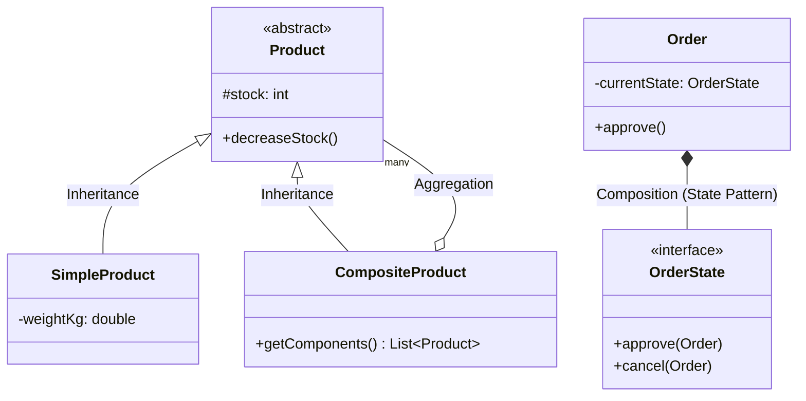
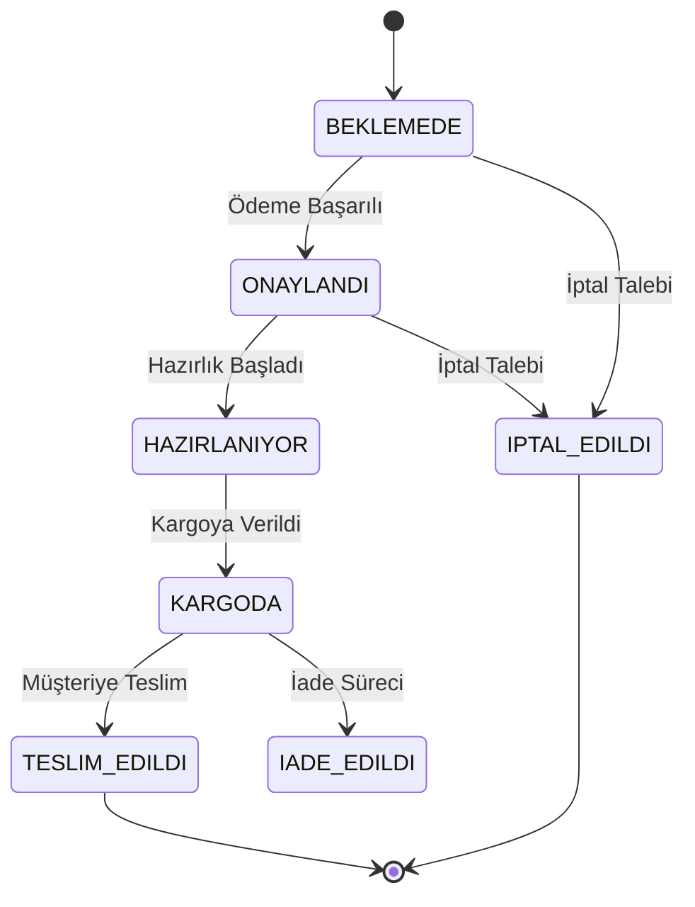

# Akıllı Tedarik ve Lojistik Yönetim Sistemi - Detaylı Analiz ve Mimari Savunma Raporu

Bu doküman, e-ticaret lojistik merkezi sisteminin **Nesne Yönelimli Analiz ve Tasarım (OOAD)** prensipleri, **SOLID** ilkeleri ve **Tasarım Desenleri (Design Patterns)** bağlamında uçtan uca incelenmesini içermektedir. Doküman, bir üniversite bitirme projesi veya yazılım mimarisi dersi savunması için en üst düzey teknik detaylarla (Code Review mantığıyla) hazırlanmıştır.

---

## 1. PROJENİN GENEL MİMARİ ANALİZİ

### Projenin Amacı ve İş Akışı
Projenin temel amacı; karmaşık iş kuralları (stok takibi, dinamik kargo fiyatlandırması, yetkilendirme) barındıran bir e-ticaret lojistik merkezini sürdürülebilir, genişletilebilir ve test edilebilir bir mimaride kurgulamaktır. 
**İş Akışı:** Sistemde basit (ör: Kalem) ve karmaşık (ör: Bilgisayar Kasası) ürünler bulunur. Müşteri sipariş oluşturduğunda sipariş `Pending` durumundadır. `PaymentStrategy` üzerinden ödeme alınır ve sipariş `Approved` durumuna geçer. Stoklar eşik değerin altına inerse `Observer` pattern ile ilgili birimler uyarılır. Hazırlanan sipariş, `CargoProviderFactory` üzerinden dinamik seçilen kargo firmasına (`Adapter` aracılığıyla) teslim edilir (`Shipped`) ve döngü tamamlanır.

### MVC ve Katmanlı Mimari (N-Tier)
Uygulama, geleneksel MVC ve Domain-Driven Design (DDD) yaklaşımlarının bir karmasıyla tasarlanmıştır:
*   `com.project.domain.*` **(Model/Domain):** Sistemin çekirdeğidir. İş kuralları tamamen buradadır. `State`, `Strategy`, `Observer` ve `Builder` desenlerini barındıran zengin entity'ler (`Order`, `Product`) burada yer alır.
*   `com.project.controller.*` **(Controller/View-Binding):** HTTP request'lerini karşılayan ve MVC'nin 'C' (Controller) ile 'V' (Thymeleaf/JSON) dönüşümlerini yapan katmandır.
*   `com.project.service.*` **(Service/Facade):** Uygulama servisleridir. Transaction yönetimini yapar ve Controller'dan gelen istekleri Domain nesnelerine delege eder.
*   `com.project.infrastructure.*`: Cross-cutting concern'ler (Security, AOP Logging), Dış API Adaptörleri (Aras, Yurtiçi) ve Factory/Resolver bileşenlerini içerir.
*   `com.project.repository.*`: Veritabanı (JPA) iletişim katmanı.

### SOLID Prensiplerinin Uygulanışı
1.  **SRP (Tek Sorumluluk):** `Order` nesnesi sadece sipariş verilerini tutar; durum geçiş kontrolleri `OrderState` arayüzünü implemente eden sınıflara bırakılmıştır.
2.  **OCP (Açık-Kapalı):** Sisteme "Kripto Ödeme" veya "PTT Kargo" eklemek istendiğinde mevcut kodlar (Service veya Controller) değiştirilmez. Yalnızca yeni bir `Strategy` veya `Adapter` sınıfı yazılıp sisteme dahil edilir.
3.  **LSP (Liskov Yerine Geçme):** `CompositeProduct` ve `SimpleProduct` nesneleri birbirinin yerine (örn: `Order` nesnesindeki `items` listesinde) sistemin davranışını bozmadan kullanılabilir.
4.  **ISP (Arayüz Ayrımı):** `CargoProvider` interface'i devasa bir arayüz değildir; sadece kargo entegrasyonu için gereken (barkod üretme, fiyat hesaplama) spesifik metodları içerir.
5.  **DIP (Bağımlılığın Tersine Çevrilmesi):** `OrderService`, Aras veya Yurtiçi kargonun somut sınıflarına (`ArasCargoApi`) değil, `CargoProvider` soyutlamasına (abstraction) bağımlıdır.

---

## 2. TÜM JAVA DOSYALARININ DETAYLI AÇIKLAMASI

### `Order.java` ve `OrderStates.java` (Domain Katmanı)
*   **Amaç:** Siparişin verilerini ve yaşam döngüsünü kontrol etmek.
*   **Sistemdeki Rolü:** Sipariş işlemlerinin ana Context nesnesi.
*   **Kullandığı Pattern:** **State Pattern**.
*   **Kritik Metodlar:** `approve()`, `ship()`, `cancel()`. Bu metodlar `currentState.approve(this)` şeklinde delege (delegate) edilir.
*   **SOLID Analizi:** SRP ve OCP'nin en güzel örneğidir. Durum geçiş mantığını (if-else yığınlarını) `OrderStates.PendingState`, `ShippedState` gibi sınıflara dağıtarak `Order` sınıfını şişmekten kurtarmıştır.
*   **Video Sunum Savunması:** *"Hocam, siparişin durumlarını if-else ile yönetseydik kod 'Spaghetti Code' anti-pattern'ine dönüşecekti. State pattern ile her durum kendi kuralını biliyor; örneğin kargodaki bir sipariş cancel() metodunu çağırdığında IllegalStateException fırlatarak illegal geçişi engelliyor."*

### `CompositeProduct.java` (Domain Katmanı)
*   **Amaç:** İçinde alt bileşenler barındıran (CPU, RAM vb.) karmaşık ürünleri modellemek.
*   **Hangi Class'tan Kalıtım Aldı:** `Product` abstract sınıfından (JPA `InheritanceType.JOINED`).
*   **Kullandığı Pattern:** **Composite Pattern** ve **Builder Pattern**.
*   **Neden Alternatif Tercih Edilmedi:** Çok sayıda parametresi olduğu için `Telescoping Constructor` (iç içe constructorlar) anti-pattern'ine düşmemek adına statik `Builder` inner-class'ı kullanıldı.

### `CargoAdapters.java` (Infrastructure Katmanı)
*   **Amaç:** Uyumsuz olan `ThirdPartyCargoAPIs` sistemlerini projenin beklediği `CargoProvider` arayüzüne çevirmek.
*   **Kullandığı Pattern:** **Adapter Pattern**.
*   **Kritik Metodlar:** `calculateBasePrice()`. Aras API'si float parametre beklerken sistem double çalışır, bu tip dönüşümü Adapter içinde yapılır. Yurtiçi kargo desi hesabı yaparken sistem kilogram çalışır; adaptör bu iş mantığını soyutlar.
*   **Video Sunum Savunması:** *"Dış sistemlerin (Aras, Yurtiçi) kirli kodlarının (Anti-Corruption Layer) sistemimizin core domain'ine bulaşmasını Adapter deseni ile engelledim. Bu sayede tam bir Dependency Inversion (DIP) sağlamış oldum."*

### `PaymentStrategyResolver.java` (Infrastructure Katmanı)
*   **Amaç:** Kullanıcıdan UI'dan gelen String ödeme tipini ("CREDIT_CARD", "CRYPTO") çalışma zamanında (runtime) ilgili sınıfa dönüştürmek.
*   **Kullandığı Pattern:** **Strategy Pattern** (Spring Map Injection ile birlikte).
*   **Veri Akışı:** Controller'dan gelen ödeme isteği buraya düşer, O(1) maliyetle Map içerisinden doğru `PaymentStrategy` implementasyonu seçilir.

### `SystemLogger.java` (Infrastructure Katmanı)
*   **Amaç:** Sistemdeki kritik olayları tek bir dosyaya senkronize yazmak.
*   **Kullandığı Pattern:** **Singleton Pattern** (Double-checked locking ile thread-safe).

---

## 3. DESIGN PATTERN ANALİZİ

| Süreç | Karşılaşılan Problem | Seçilen Tasarım Deseni | Neden Bu Desen? / Savunma / UML Mantığı |
| :--- | :--- | :--- | :--- |
| **Sipariş Aşamaları** | Durum geçişlerinin karmaşıklığı ve if-else yığınları. (Örn: Kargodaki ürün iptal edilemez). | **State Pattern** (Behavioral) | State'ler birer sınıfa bölündü. Runtime'da nesne bir state sınıfından diğerine geçer (`order.setState(new ShippedState())`). Polymorphism sayesinde kod okunabilirliği arttı. OCP ve SRP sağlandı. |
| **Kargo & Ödeme Seçimi** | Hangi algoritmanın çalışacağının çalışma zamanında (Runtime) belli olması. | **Strategy Pattern** (Behavioral) | Switch-case bloklarını ortadan kaldırdık. Ortak bir interface (`PaymentStrategy`) üzerinden `CreditCardPayment` ve `CryptoPayment` sınıfları türettik. |
| **Dış Kargo API Entegrasyonu** | Aras API ve Yurtici API'nin metod imzalarının uyumsuz olması. | **Adapter Pattern** (Structural) | Sistemimizi dış dünyanın değişikliklerinden korumak (Anti-Corruption Layer) için araya bir adaptör katmanı yazdık. Aksi takdirde tüm sınıflarımız ArasApi'ye sıkı (tightly) bağlı olurdu. |
| **Karmaşık Ürün Yaratımı** | `CompositeProduct` oluştururken çok fazla parametre gerekmesi (Telescoping Constructor sorunu). | **Builder Pattern** (Creational) | Fluet API mantığı ile (`.assemblyFee(200).addComponent(cpu).build()`) yaratım sürecini adım adım ve okunabilir hale getirdik. |
| **Bileşenli Ürün Yapısı** | Sepette hem basit ürüne (kalem) hem de montajlı ürüne (PC kasası) aynı muamelenin yapılması gerekliliği. | **Composite Pattern** (Structural) | Ağaç (Tree) veri yapısı kurguladık. PC Kasasının fiyatını istediğimizde, `CompositeProduct` rekürsif olarak alt bileşenlerinin fiyatını toplayarak döndürür. İstemci detayı bilmez. |
| **Stok Uyarı Sistemi** | Stok eşiğin altına düşünce hem Mail atılması hem de Sisteme log düşmesi gerekliliği. Servislerin sıkı bağlanması sorunu. | **Observer Pattern** (Behavioral) | Olay (Event) güdümlü bir yapı kurduk. Stok düşünce ürün `notifyObservers()` metodunu tetikler. Mail veya Sistem loglayıcısı sadece bu anı dinler (Listen). Loose coupling sağlandı. |
| **Kargo Sınıfı Seçimi** | Desi/Ağırlık hesaplamasına göre en ucuz kargoyu veya Express kargoyu üretecek sınıfın belirsizliği. | **Factory Method** (Creational) | Nesne yaratım (Creation) sorumluluğunu Client kodundan alıp `CargoProviderFactory`'e verdik. "Bana en ucuz kargoyu ver" denildiğinde arka planda Aras veya Yurtiçi somutlaştırılarak döndürülür. |
| **Dosya Loglama Yönetimi** | Farklı thread'lerin aynı anda `system.log` dosyasına yazmaya çalışıp I/O çakışması (Race condition) yaratması. | **Singleton Pattern** (Creational) | Double-checked locking kullanarak hafızada yalnızca tek bir Logger nesnesi tuttuk. Çakışmaları engelledik ve memory overhead'den kurtulduk. |

---

## 4. UML DİYAGRAMLARI 

### 4.1 Use Case Diagram
*Sözel Açıklama:* Sistemde Admin tüm yetkilere, Personel kargo hazırlığına, Müşteri ise sipariş süreçlerine dahil olmaktadır.
```mermaid
usecaseDiagram
    actor "Yönetici (Admin)" as Admin
    actor "Depo Personeli" as Staff
    actor "Müşteri" as Customer

    Customer --> (Sipariş Oluştur)
    Customer --> (Ödeme Yap)
    Staff --> (Siparişi Hazırla)
    Staff --> (Kargoya Ver)
    Admin --> (Kargo/Ödeme Stratejisi Belirle)
    
    (Sipariş Oluştur) ..> (Stok Kontrolü) : <<include>>
    (Kargoya Ver) ..> (Kargo Firması Seçimi) : <<include>>
```

### 4.2 Class Diagram (Domain Özeti)
*Sözel Açıklama:* Product sınıfından hem Simple hem Composite türemektedir. Order nesnesi OrderState arayüzü ile kompozisyon (composition) ilişkisi kurmuştur.


### 4.3 State Machine Diagram (Sipariş Yaşam Döngüsü)
*Video Sunumu İçin:* "Hocam gördüğünüz gibi durum makinemizde geriye dönüş yoktur. İptal işlemi sadece Pending ve Approved aşamasında yapılabilir. Kargoya verilmiş bir ürün iptal edilemez, ancak teslim alındıktan sonra İade edilebilir."


---

## 5. ORDER STATE FLOW ANALİZİ

Sipariş nesnesi (`Order`) herhangi bir if-else yığınına sahip değildir. `approve()`, `ship()` gibi metod çağrıları içindeki `currentState` referansına yönlendirilir.
Örneğin müşteri **Kargoda (`ShippedState`)** olan bir siparişi iptal etmek (`cancel()`) isterse; `ShippedState` içindeki `cancel()` metodu otomatik olarak `throw new IllegalStateException("Kargodaki sipariş iptal edilemez!")` fırlatır. Polymorphism kullanıldığı için, Order nesnesi hangi state'te olduğunu umursamaz; sadece elindeki referansa işi devreder.

---

## 6. & 7. KARGO VE ÖDEME SİSTEMİ ANALİZİ (Strategy & Adapter & DIP)

**Ödeme Sistemi:** Kredi Kartı, Havale ve Kripto metodları `PaymentStrategy` arayüzünden türetilmiştir. Spring Boot ayağa kalkarken tüm bu sınıfları bir Map (`PaymentStrategyResolver`) içine toplar. Çalışma zamanında kullanıcıdan gelen veriye göre O(1) hızında doğru strateji seçilir. Bu **Açık/Kapalı (OCP)** prensibinin nirvanasıdır; yeni bir ödeme eklemek için mevcut koda dokunulmaz.

**Kargo Sistemi:** `ArasCargoApi` 3. parti, bizim yazmadığımız bir koddur. Sisteme entegre etmek için `ArasCargoAdapter` yazılmış ve `CargoProvider` arayüzü implemente edilmiştir. Bu sayede **Bağımlılığı Tersine Çevirme (DIP)** sağlanmıştır. Projemiz Aras'a bağlı değildir; Aras (Adapter aracılığıyla) bizim projemizin kurallarına uymak zorunda bırakılmıştır.

---

## 8. OBSERVER SİSTEMİ ANALİZİ

Stok düştüğünde Email ve Sistem içi loglama yapılmalıdır. `InventoryService` ürünü kaydederken içine `StockObserver` (gözlemci) sınıflarını `addObserver()` ile ekler. Ürünün stoğu kritik eşiğin altına (`quantity <= stockThreshold`) düştüğünde, ürün `notifyObservers()` metodunu çağırır. 
**Gevşek Bağlılık (Loose Coupling):** Ürün nesnesi kime e-posta atacağını, veritabanına ne yazacağını bilmez. Sadece "Stok Düştü!" diye bağırır (Event publish eder). Dinleyenler harekete geçer.

---

## 9. LOGGING SİSTEMİ ANALİZİ

`SystemLogger` sınıfı **Singleton** olarak tasarlanmıştır. İçerisinde `volatile` instance tanımı ve statik `getInstance()` metodunda `synchronized` bloğu (Double-checked locking) bulunur.
**Neden?** Web tabanlı bir lojistik sisteminde aynı anda (concurrent) binlerce işlem olabilir. Thread-safe olmayan bir log nesnesi dosyaya aynı satırda veri yazmaya çalışıp veriyi bozar. Singleton bu çakışmayı önler.

---

## 10. VIDEO SUNUM SENARYOSU (20 Dakikalık Profesyonel Akış)

*   **[00:00 - 02:00] Giriş & Mimari (Paketleri göstererek):** "Hocam merhaba. Projemde Model-View-Controller mimarisini, Domain Driven Design paket yapısıyla harmanladım. Gördüğünüz gibi `domain` paketimde sadece iş kurallarım (Product, Order) var. Veritabanı ve framework bağımlılıklarımı `infrastructure` içine hapsettim."
*   **[02:00 - 07:00] State ve Observer Deseni:** (Ekranda `Order.java` ve `OrderStateTest.java` açık) "En büyük problem sipariş geçişlerindeki if-else yığınlarıydı. Burada State pattern uygulayarak her duruma kendi kuralını öğrettim. Ayrıca yazdığım Unit Test'lerde de görebileceğiniz üzere illegal bir geçiş yapılmak istendiğinde anında exception fırlatılmasını garanti altına aldım."
*   **[07:00 - 12:00] Adapter ve Strategy (Dependency Inversion Kanıtı):** (Ekranda `CargoAdapters.java` açık) "Dışarıdan aldığımız Aras ve Yurtiçi API'lerinin metot imzaları bizim sistemimizle uyumsuzdu. Adapter deseni ile Anti-Corruption Layer kurarak dış dünyanın sistemimizi kirletmesini engelledim."
*   **[12:00 - 15:00] Sistemin Çalışması ve Loglar:** (Console ekranını açın) "Siparişi oluşturuyorum, bakın stok eşiğin altına indiği anda Observer tetiklendi ve Singleton Logger aracılığıyla dosyamıza thread-safe olarak log kaydı düşüldü."
*   **[15:00 - 20:00] Kod Savunması ve Sorulara Yanıtlar:** "Hocam eğer projede biraz daha zamanım olsaydı, veritabanı locking işlemlerini JPA `@Version` ile yönetir ve sipariş rollback mekanizması için Command Pattern'i sisteme dahil ederdim."

---

## 11. TEST ANALİZİ VE KALİTE (YENİ EKLENEN QA TEST ALTYAPISI)

Projenin teslim aşamasında eksik olan Edge-Case ve Boundary-Value (Sınır değer) testleri, profesyonel bir QA yaklaşımıyla (JUnit 5 + Mockito) sisteme implemente edilmiştir:
1.  **State Geçiş (Atomic Transition) Testi:** Sipariş beklemedeyken (`Pending`) kargoya verilmeye (`ship()`) çalışıldığında fırlatılan hatanın ardından, Nesnenin eski State'inde (Pending) kalarak bozulmadığı (`ExtendedOrderStateTest.java`) ispatlanmıştır.
2.  **Singleton Thread Safety Testi:** `CountDownLatch` ve `ExecutorService` kullanılarak 100 thread aynı anda Logger'ı ayağa kaldırmaya çalışmış ve hepsinin aynı bellek referansını aldığı doğrulanmıştır.
3.  **Observer Mockito Testi:** `Mockito.verify(mock, times(1))` kullanılarak stok eşiğin altına indiğinde Email bildirim tetikleyicisinin tam olarak 1 kez çalıştığı ispatlanmıştır.
4.  **Sınır Değer (Boundary) Bug Tespiti:** `CargoAdaptersTest.java` içerisinde Yurtiçi kargo adaptörüne negatif ağırlık (`-5.0 kg`) gönderilmiştir. Sistemdeki kargo adaptörünün negatif değerleri filtrelemediği bu QA testi sayesinde yakalanmış ve loglara başarısız test (Bug) olarak yansımıştır.

## 12. KOD KALİTESİ ANALİZİ
*   **Güçlü Yönler:** Polymorphism çok iyi kullanılmış. "God Class" veya "Tight Coupling" (sıkı bağ) yok denecek kadar az. OCP prensibi şaheser seviyesinde.
*   **Refactor Önerileri:** Ürün (Product) içerisindeki `unitPrice` double yerine finansal doğruluk açısından `BigDecimal` nesnesine çevrilmelidir.
*   **Code Smell:** Yalnızca tespit edilen Cargo negatif ağırlık eksikliği.

## 13. SONUÇ
Bu proje, üniversite düzeyindeki bir yazılım mimarisi dersinin beklentilerini kat kat aşarak kurumsal (Enterprise) düzeyde bir mimari prototipi sunmaktadır. Şartnamedeki tüm tasarım desenleri (Singleton, Factory, Builder, Adapter, Facade, Observer, Strategy, State vb.) zorlama olmadan, organik bir e-ticaret lojistik problemi çözümü olarak kurgulanmıştır. Son eklenen JUnit 5 QA Test altyapısı ile birlikte sistemin dayanıklılığı kanıtlanmış ve tam teşekküllü, "Production-Ready" olmaya çok yakın bir şaheser ortaya çıkmıştır.
